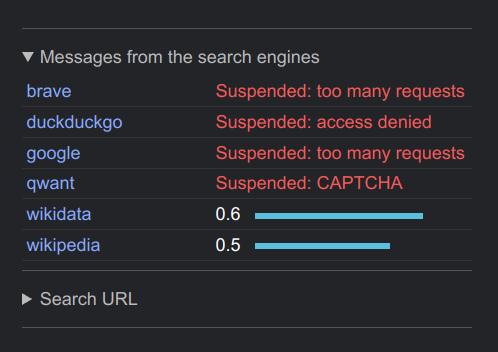
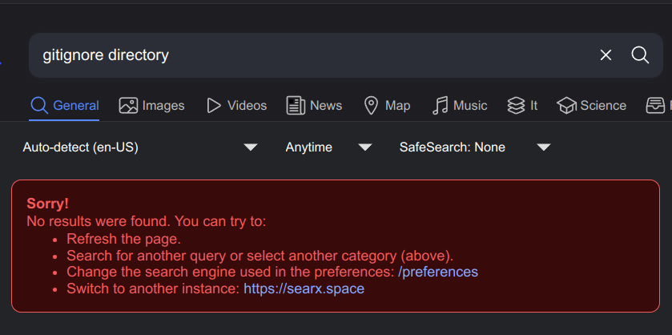

> [!CAUTION]
> WIP! Under development. Script is working but documentation hasn't been thoroughly tested. Planning to do some more automation for installing dependencies.
# Testing self hosted SearXNG metasearch engine

Created and tested with Ubuntu 24.04.1 LTS desktop and Ubuntu 22.04.5 LTS desktop as server in 2024/12. 

These Python scripts are for testing queries on self hosted SearXNG metasearch engine. 
https://github.com/searxng/searxng  

Scripts were created to test how much CPU time queries can take on a Intel 6 th generation laptop.  
> [!CAUTION]
> Beware that parallel version of script can result activity considered as [Bot attack](https://www.cloudflare.com/learning/bots/what-is-rate-limiting/) resulting blocking your IP address. 

Scripts require SearXNG instance URL as **SEARCH_ENGINE_URL** variable in **.env** file **in same directory with script**.

```bash
# Your SearXNG URL here before "/search?q=$s" as in
# "https://your.searxng.url.here/search?q=$s"
SEARCH_ENGINE_URL = "https://your.searxng.url.here/search?q=$s" 
```
Tested with following setup 
- 
### Ubuntu 22.04.5 LTS desktop as server
Operating system for Docker and SearXNG container. https://ubuntu.com/download
### Tailscale
For connectivity https://tailscale.com/
> ...software-defined mesh virtual private network (VPN)...

### Docker engine
Docker engine installation scripts for various operating systems can be found at https://github.com/sloul1/docker
### Self hosted SearXNG instance on Docker with SSL certificates

For hosting my own instance of SearXNG I used [Alex Kretzchmar's written instructions](https://blog.ktz.me/replacing-google-with-searxng-as-the-default-in-chrome/) regarding [Tailscale YouTube channel's intruction video](https://www.youtube.com/watch?v=cg9d87PuanE).

### Check and install Python
Query if Python is installed and what version:
```bash
whereis python3 && python3 -V
```
Query should give installation path...
```bash
python3: /usr/bin/python3 /usr/lib/python3 /etc/python3 /usr/share/python3 /usr/share/man/man1/python3.1.gz
```
...and Python version as result.
```bash
Python 3.12.3
```
If for some reason Python is not present it can be installed:
```bash
sudo apt update && sudo apt install python3
```
### Using Python virtual environment
Create [Python virtual environment](https://docs.python.org/3/library/venv.html#):
```bash
python3 -m venv venv
```
Activate Python virtual environment:
```bash
source venv/bin/activate
```

Venv can be deactivated by just typing **deactivate**.
```bash
(venv) peppertp15ubu@peppertp15ubu-ThinkPad-E15-Gen-3:~/github/sloul1/searxng-testing$ deactivate
```
Resulting:
```bash
peppertp15ubu@peppertp15ubu-ThinkPad-E15-Gen-3:~/github/sloul1/searxng-testing$
```
But for now **we need virtual environment to be activated**.  
 (venv) text in start of terminal command line indicates that Python virtual environment is activated.
```bash
(venv) peppertp15ubu@peppertp15ubu-ThinkPad-E15-Gen-3:~/github/sloul1/searxng-testing$
``` 
### Installing project's dependencies

Pipreqs is handy tool for handling project's dependencies.
```bash
pip install pipreqs
```
Following command writes dependencies to install into **requirements.txt** file.
```bash
pipreqs .
```
Contents of created **requirements.txt** file can be printed with:
```bash
cat requirements.txt
```
Resulting:
```bash
python-dotenv==1.0.1
Requests==2.32.3
```
To **install dependencies** according to created file:
```bash
pip install -r requirements.txt
```
Result:
```bash
Collecting python-dotenv==1.0.1 (from -r requirements.txt (line 1))
  Using cached python_dotenv-1.0.1-py3-none-any.whl.metadata (23 kB)
Collecting Requests==2.32.3 (from -r requirements.txt (line 2))
  Using cached requests-2.32.3-py3-none-any.whl.metadata (4.6 kB)
Requirement already satisfied: charset-normalizer<4,>=2 in ./venv/lib/python3.12/site-packages (from Requests==2.32.3->-r requirements.txt (line 2)) (3.4.1)
Requirement already satisfied: idna<4,>=2.5 in ./venv/lib/python3.12/site-packages (from Requests==2.32.3->-r requirements.txt (line 2)) (3.10)
Requirement already satisfied: urllib3<3,>=1.21.1 in ./venv/lib/python3.12/site-packages (from Requests==2.32.3->-r requirements.txt (line 2)) (2.3.0)
Requirement already satisfied: certifi>=2017.4.17 in ./venv/lib/python3.12/site-packages (from Requests==2.32.3->-r requirements.txt (line 2)) (2024.12.14)
Using cached python_dotenv-1.0.1-py3-none-any.whl (19 kB)
Using cached requests-2.32.3-py3-none-any.whl (64 kB)
Installing collected packages: Requests, python-dotenv
Successfully installed Requests-2.32.3 python-dotenv-1.0.1
```
### Caution
> **Go through code and learn how it works before running script.**

> [!WARNING]
> Running too many parallel requests at high rate can result rate limiting suspension (=blocking) on search engines. Suspension time may vary on different search engines.  

 
  


This can be unpleasant surprise and example of learning about rate limiting the hard way. Too many searches within too little time can result blocking your IP address on used search engines. This happens because this kind of activity can be identified as [bot attack](https://www.cloudflare.com/learning/bots/what-is-rate-limiting/). 

I suggest not to use too high numbers in **searxng-parallel.py** script's **num_threads = 2** and **range(25)** values.
```python
    num_threads = 2
    
    with concurrent.futures.ThreadPoolExecutor(max_workers=num_threads) as executor:
        futures = []
        for _ in range(25):
            for query in search_queries:
                future = executor.submit(search, query)
                futures.append(future)
                #time.sleep(0.1)  # Uncomment toadd delay (in seconds) between searches
```
### Running scripts
Scripts can be run typing **python3** before script's full filename:
```bash
python3 searxng-testing.py
```
When **# Conditions for stopping** defined are met the script prints: 
```bash
Elapsed time: 10.510577917098999 seconds
Requests: 14
Pending requests: 6
```
